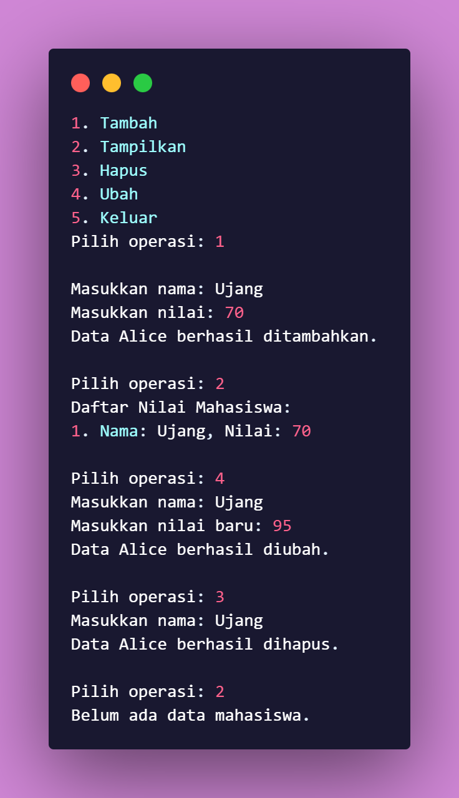

# Daftar Nilai Mahasiswa

Program ini adalah aplikasi sederhana berbasis Python yang digunakan untuk mengelola daftar nilai mahasiswa. Program ini menggunakan konsep **Object-Oriented Programming (OOP)** dengan memanfaatkan class dan method.

## Diagram Class
  
Dikarenakan pada program ini hanya memiliki satu buah *Class* maka **Diagram Class** Akan terlihat seperti itu  

## Fitur Program

1. **Menambah data Mahasiswa**  
Anda dapat menambahkan data mahasiswa baru, termasuk nama dan nilai mereka.
2. **Menampilkan daftar nilai Mahasiswa**  
Program akan menampilkan semua data mahasiswa yang telah ditambahkan.
3. **Menghapus data Mahsiswa berdasarkan Nama**  
Data mahasiswa tertentu dapat dihapus berdasarkan nama.
4. **Mengubah nilai Mahasiswa berdasarkan Nama**  
Anda dapat mengubah nilai mahasiswa yang sudah ada dalam daftar.

## Struktur Class dan Method
**Class:** `Daftar nilai Mahasiswa`  
  
Class ini bertanggung jawab untuk menyimpan dan mengelola data mahasiswa.  

**Method:**  
1. `tambah(nama, nilai)`  
  
Menambahkan data mahasiswa berupa nama dan nilai ke dalam daftar.  
**Parameter:** 
* `nama` : Nama Mahasiswa (*string*)
* `nilai` : Nilai Mahasiswa (*integer*)  

2. `tampilkan()`  
  
Menampilkan seluruh data mahasiswa yang tersimpan. Jika tidak ada data, program akan memberi tahu bahwa daftar kosong.  

3. `hapus(nama)`  
  
Menghapus data mahasiswa berdasarkan nama.
**Parameter:** 
* `nama` : Nama Mahasiswa yang ingin dihapus (*string*)  

4. `ubah (nama, nilai_baru)`  
  
Mengubah nilai mahasiswa berdasarkan nama.
**Parameter:** 
* `nama` : Nama Mahasiswa yang ingin diubah (*string*)
* `nilai` : Nilai baru untuk Mahasiswa tersebut (*integer*)

## Contoh Penggunaan
Berikut adalah contoh output saat menjalankan program:

## Teknologi yang Digunakan
**Python 3.10 atau lebih baru**

# Terima kasih 👍